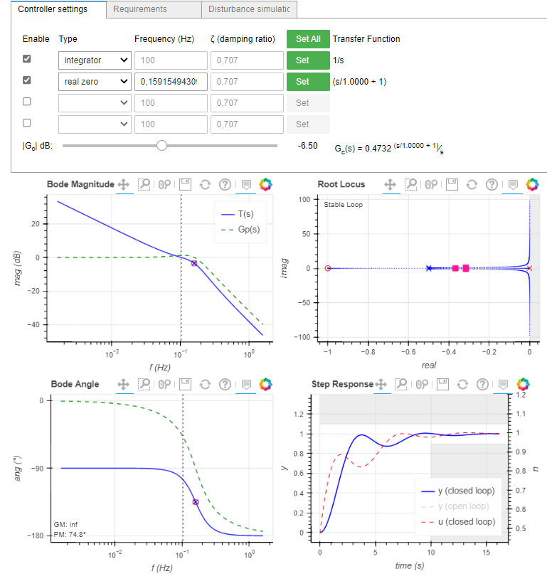
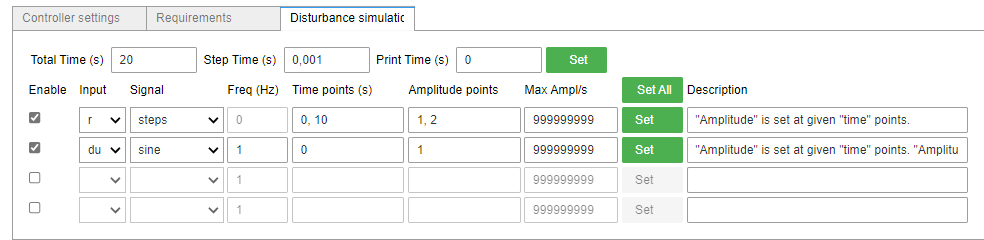
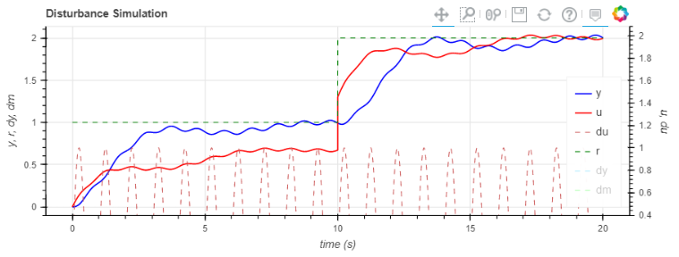

# Python Siso Design App

User interface for designing Single-Input-Single-Output Controllers in Google Colab.

Developer: Prof. Lucas Vizzotto Bellinaso
<br>Universidade Federal de Santa Maria
<br>15/10/2020

## Copy this code to the first cell in Google Colab:

``` python
# Copy and run in the first cell:
!pip install bokeh             # Bokeh package must be installed in Google Colab server
!pip install control           # Control package must be installed in Google Colab server
!git clone https://github.com/lucasbellinaso/PythonSisoDesignApp.git
import os
os.chdir("PythonSisoDesignApp")
!python classes.py             # running the github code
from classes import SISOApp    # importing the SISOApp
from control.matlab import *   # importing control package as a Matlab environment
#help(SISOApp)
```
If you have any AdBlock installed: disable GitHub and Google Colab blocking.


## Help

``` python
help(SISOApp)
```

## Example - control design

``` python
from control.matlab import tf
Gp = tf(1,[1,1,1])
Gc = tf([1,1],[1,0])
App = SISOApp(Gp, Gc)    #Controller: App.Gc
```

## Figures






